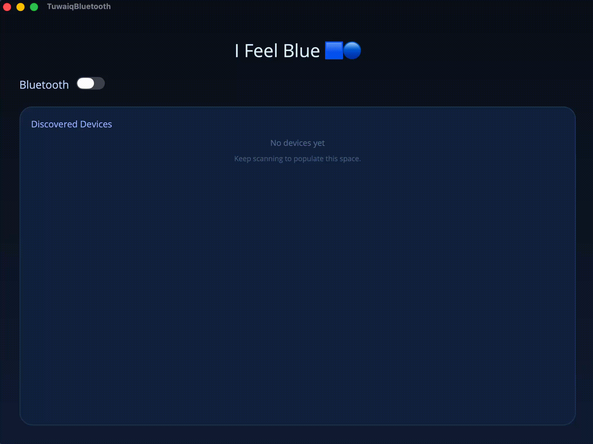

# I Feel Blue 🟦🔵

I Feel Blue is a .NET 8 MAUI desktop app for macOS that lets you flip a switch and locate all bluetooth devices nearby.



## ✨ What’s inside

- Single-page UI with a toggle that starts/stops CoreBluetooth scans.
- Real-time list of nearby discoverable devices
- Clean gradients, rounded cards, and zero patience for clutter

## 🧰 Prerequisites

- macOS 13+ with Bluetooth hardware (laptops count, toaster ovens sadly do not).
- .NET 8 SDK (`dotnet --version`)
- Xcode command-line tools (`xcode-select --install` if unsure)
- A couple of discoverable bluetooth devices to prove the app works (earbuds, phones, dev kits, etc.)

## 🚀 How to run it

```
dotnet build TuwaiqBluetooth.sln
```

```
dotnet run --framework net8.0-maccatalyst --project TuwaiqBluetooth
```

Then:

1. Wait for the window to appear and tap the **Bluetooth** switch
2. Keep the window active so macOS doesn’t throttle the scan.
3. Watch devices stroll into the blue list; flip the switch off when you’re done.
